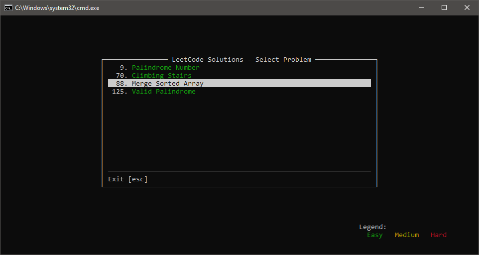

# LeetPlusPlus

A professional C++ development framework for LeetCode problem solving, featuring automated problem generation, integrated testing, and an intuitive terminal interface.



## Overview

LeetPlusPlus provides a comprehensive local development environment that seamlessly integrates LeetCode problems into your C++ workflow. The framework eliminates the friction between web-based problem solving and professional software development practices by offering automated scaffolding, robust testing utilities, and efficient problem management.

## Key Features

**Automated Problem Generation** - Transform LeetCode problems into properly structured C++ files with a single command, including automatic type handling and include management.

**Integrated Testing Framework** - Comprehensive assertion library with detailed output formatting, supporting all common data structures and custom test cases.

**Professional Terminal Interface** - Navigate and execute problems through a polished PDCurses-based UI with color-coded difficulty indicators and real-time output display:
- 🟢 Easy problems displayed in green
- 🟡 Medium problems displayed in yellow  
- 🔴 Hard problems displayed in red
- Fixed navigation bar with exit option always visible
- Scrollable problem list for large collections
- Clean, modern interface with proper windowing

**Intelligent Code Generation** - Automatic STL type prefixing, smart include detection based on method signatures, and template-based code generation.

**Metadata Management** - Persistent tracking of problem information including difficulty levels, topic tags, and company associations.

**Cross-Platform Build System** - Premake5-based configuration supporting Windows, Linux, and macOS development environments.

## Installation

### Prerequisites

Ensure your development environment meets the following requirements:

- C++20 compatible compiler (MSVC 2019 16.8+, GCC 10+, or Clang 11+)
- Premake5 build configuration generator
- Python 3.6 or higher for problem generation scripts
- Git for version control

### Setup Instructions

Clone the repository and initialize the build system:

```bash
git clone https://github.com/yourusername/leetplusplus.git
cd leetplusplus
premake5 [target]
```

Where `[target]` corresponds to your development environment:
- `vs2022` for Visual Studio 2022
- `gmake2` for GNU Make
- `xcode4` for Xcode

## Usage Guide

### Generating New Problems

The framework provides multiple methods for creating new problem solutions:

**Command Line Generation**
```bash
premake5 new-problem 42 --title="Trapping Rain Water" --signature="int trap(vector<int>& height)" --difficulty=Hard --topics="Array,Two Pointers"
```

**Interactive Mode**
```bash
premake5 new-problem-interactive
```

### Running the Application

Launch the terminal interface using the provided convenience scripts:

**Windows:**
```bash
# Command Prompt
leetcode.bat

# PowerShell
.\leetcode.ps1
```

**Linux/macOS:**
```bash
./leetcode.sh
```

Or run directly:
```bash
./bin/Debug/LeetPlusPlus
```

**Navigation controls:**
- ↑/↓ Arrow keys to navigate the problem list
- Enter to execute selected problem
- ESC or Q to exit
- Page Up/Down for faster scrolling (when list exceeds window size)

### Writing Solutions

Generated problems follow a consistent structure that integrates with the testing framework:

```cpp
class Solution42
{
public:
    int Trap(std::vector<int>& height)
    {
        // Implementation details
        int left = 0, right = height.size() - 1;
        int leftMax = 0, rightMax = 0;
        int water = 0;
        
        while (left < right)
        {
            if (height[left] < height[right])
            {
                if (height[left] >= leftMax)
                    leftMax = height[left];
                else
                    water += leftMax - height[left];
                left++;
            }
            else
            {
                if (height[right] >= rightMax)
                    rightMax = height[right];
                else
                    water += rightMax - height[right];
                right--;
            }
        }
        
        return water;
    }
};
```

### Testing Solutions

The framework provides comprehensive testing utilities:

```cpp
void TestProblem42()
{
    Solution42 solution;
    TestRunner::Start("Trapping Rain Water");
    
    // Standard test cases
    ASSERT_EQ(solution.Trap(std::vector<int>{0,1,0,2,1,0,1,3,2,1,2,1}), 6);
    
    // Edge cases
    TEST_CASE("Empty array");
    ASSERT_EQ(solution.Trap(std::vector<int>{}), 0);
    
    TEST_CASE("No water trapped");
    ASSERT_EQ(solution.Trap(std::vector<int>{3,2,1}), 0);
    
    TestRunner::PrintSummary();
}
```

## Architecture

### System Components

The framework consists of four primary subsystems working in concert:

**Problem Generation Engine** - Python-based system that parses LeetCode method signatures, generates C++ templates, and manages project configuration updates.

**Solution Registry** - Compile-time registration system that automatically discovers and manages all problem solutions through template metaprogramming.

**Testing Framework** - Comprehensive assertion library with support for primitive types, STL containers, and custom data structures, providing detailed failure diagnostics.

**User Interface Layer** - PDCurses-based terminal interface offering responsive navigation, color-coded visual feedback, and real-time output capture.

## Advanced Configuration

### Custom Problem Templates

Modify the template system by editing `tools/template.h`. The template engine supports variable substitution, conditional sections, and automatic formatting based on problem metadata.

### Extending the Framework

The modular architecture facilitates extensions through well-defined interfaces:

- Add custom assertion types in `TestUtils.h`
- Implement new UI components by extending the `Window` base class
- Create additional problem metadata fields in the generation system
- Integrate external tools through the Premake action system

## Performance Considerations

The framework prioritizes developer productivity while maintaining runtime efficiency:

- Template-based registration incurs no runtime overhead
- UI rendering optimizes for minimal screen updates
- Test execution captures output efficiently through stream redirection
- Problem discovery occurs at compile time through static initialization

## Troubleshooting

### Common Issues

**Build Failures** - Ensure all prerequisites are installed and paths are correctly configured. Verify compiler support for C++20 features.

**Problem Generation Errors** - Check Python installation and validate method signatures follow C++ syntax requirements.

**UI Display Issues** - Confirm PDCurses is properly linked and terminal supports required capabilities.

### Debug Mode

Enable verbose output for troubleshooting:
```bash
./LeetPlusPlus --debug
```

## Contributing

We welcome contributions that enhance the framework's capabilities while maintaining its design principles. Please ensure all submissions include appropriate tests and documentation updates.

## License

This project is licensed under the MIT License. See LICENSE file for complete terms.
