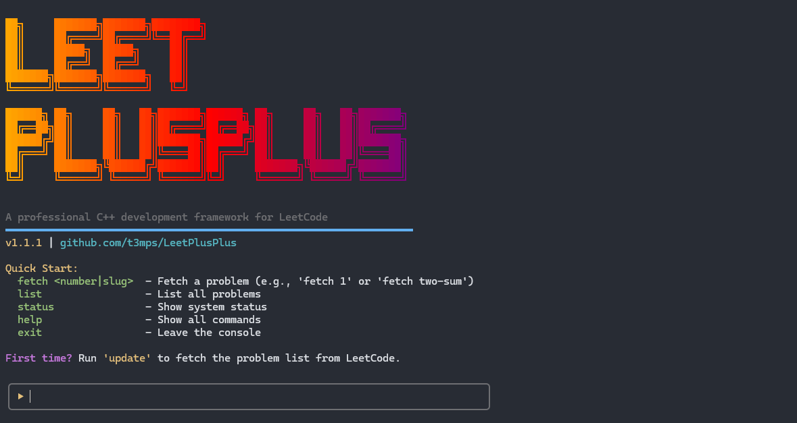
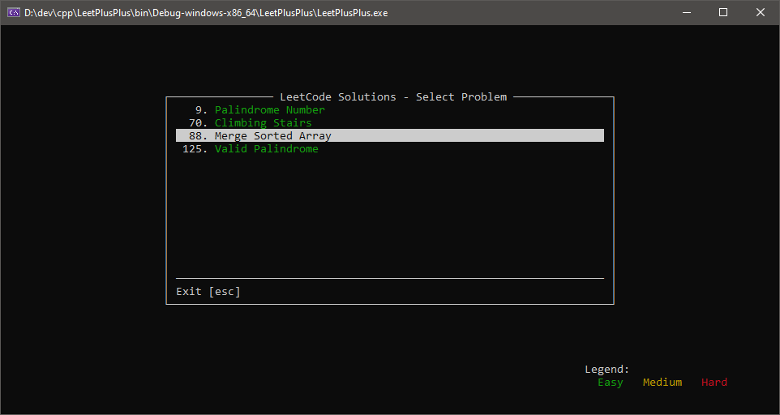
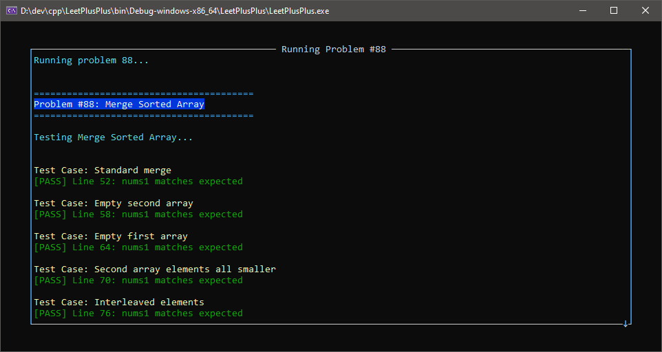

# LeetPlusPlus



A professional C++ development framework for LeetCode problem solving, featuring an interactive CLI, automated problem fetching, integrated testing, and a native terminal interface.

## 🚀 Quick Start

```bash
# Enter interactive console
lpp

# Or use direct commands
lpp fetch 1            # Fetch Two Sum
lpp list               # Show all problems
lpp update             # Update problem metadata
```

## ✨ Key Features

### Automated Problem Management
- **Fetch by Number**: `fetch 1` - Two Sum
- **Fetch by Slug**: `fetch two-sum`  
- **Daily Challenge**: `fetch daily`
- **Random Problems**: `random medium`
- **Smart Filtering**: `list --difficulty easy --limit 10`

### Professional Code Generation
- Automatic C++ template generation with proper includes
- Smart type conversion (LeetCode → C++)
- Integrated test case parsing
- Company and topic tag tracking

### Native Terminal UI
- 🟢 Easy problems in green
- 🟡 Medium problems in yellow
- 🔴 Hard problems in red
- Navigate with arrow keys
- Execute problems with Enter

## 📋 Prerequisites

- **C++ Compiler**: C++17 compatible (MSVC 2019+, GCC 7+, Clang 5+)
- **Build System**: Premake5
- **Python**: 3.6+ with pip
- **Node.js**: For LeetCode API (auto-managed)
- **Git**: For cloning the repository

## 🛠️ Installation

### 1. Clone the Repository
```bash
git clone --recursive https://github.com/yourusername/LeetPlusPlus.git
cd LeetPlusPlus
```

### 2. Install Python Dependencies
```bash
pip install -r requirements.txt
```

### 3. Build the Project
```bash
# Windows (Visual Studio 2022)
premake5 vs2022

# Linux/macOS
premake5 gmake2
make

# Xcode
premake5 xcode4
```

### 4. First Run
```bash
# Enter the console
lpp

# Update problem metadata (first time)
▶ update
```

## 🎯 Usage Guide

### Console Commands

| Command | Description | Example |
|---------|-------------|---------|
| `fetch <id\|slug>` | Fetch a problem | `fetch 1` or `fetch two-sum` |
| `list` | List all problems | `list --difficulty easy` |
| `update` | Update problem metadata | `update` |
| `generate <id>` | Generate solution file | `generate 42` |
| `random [difficulty]` | Fetch random problem | `random medium` |
| `status` | Show system status | `status` |
| `help` | Show help | `help fetch` |
| `clear` | Clear screen | `clear` |
| `exit` | Exit console | `exit` |

### Writing Solutions

Generated problems follow this structure:

```cpp
#pragma once
#include "../Base/TestUtils.h"
#include <vector>

class Solution1 {
public:
    std::vector<int> TwoSum(std::vector<int>& nums, int target) {
        // Your solution here
        return {};
    }
};

void TestSolution1() {
    Solution1 solution;
    TestRunner runner("1. Two Sum");
    
    // Test cases are auto-generated
    runner.addTest({1, 2, 3}, 4, {0, 2});
    runner.addTest({2, 7, 11, 15}, 9, {0, 1});
    
    runner.run([&](auto& nums, auto target) {
        return solution.TwoSum(nums, target);
    });
}
```

### Testing Framework

The framework provides comprehensive testing utilities:

```cpp
// Assertion macros
ASSERT_EQ(actual, expected)           // Basic equality
ASSERT_VECTOR_EQ(vec1, vec2)          // Vector comparison
ASSERT_TREE_EQ(tree1, tree2)          // Tree structure comparison
ASSERT_LINKED_LIST_EQ(list1, list2)   // Linked list comparison

// Test organization
TEST_CASE("Edge case description")
TestRunner::PrintSummary()
```




## 🔧 Configuration

### Project Structure
```
LeetPlusPlus/
├── src/
│   ├── Problems/        # Generated problem solutions
│   ├── Base/           # Core framework code
│   ├── Common/         # Shared utilities
│   └── UI/             # Terminal interface
├── tools/              # Python CLI and utilities
├── vendor/             # Third-party dependencies
└── lpp.py             # Main CLI entry point
```

### API Configuration
The AlfaLeetCode API server is managed automatically. If needed, you can configure:
- **API URL**: Default `http://localhost:3000`
- **Auto-start**: Enabled by default
- **Manual start**: `cd vendor/AlfaLeetCode && npm start`

## 🐛 Troubleshooting

### Common Issues

**"No metadata found"**
```bash
lpp update  # Fetches problem list from LeetCode
```

**"API server not running"**
- The server should auto-start
- Check if port 3000 is available
- Try manual start: `cd vendor/AlfaLeetCode && npm install && npm start`

**"Problem already exists"**
```bash
lpp fetch 1 --force  # Overwrite existing solution
```

**Build Issues**
- Ensure Premake5 is in your PATH
- Check compiler compatibility (C++17 required)
- On Windows, use "x64" configuration in Visual Studio

## 🤝 Contributing

Contributions are welcome! Please ensure:
- Code follows existing style conventions
- Documentation is updated
- Commit messages are descriptive

## 📄 License

This project is licensed under the MIT License. See [LICENSE](LICENSE) file for details.

## 🙏 Acknowledgments

- [AlfaLeetCode](https://github.com/alfaarghya/alfa-leetcode-api) for the API server
- [PDCurses](https://github.com/wmcbrine/PDCurses) for terminal UI support
- LeetCode for the problem content

---

**Note**: This project is not affiliated with LeetCode. It's an independent tool to enhance the LeetCode problem-solving experience for C++ developers.
